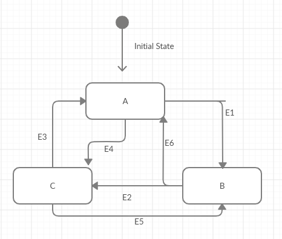

# Spring Boot State Machine Example
Spring Boot State Machine Basics more details(https://docs.spring.io/spring-statemachine/docs/current/reference/)

# Docker

Please run docker-compose file or build the project.

```
docker-compose up
```

# State Diagram



# Rest Endpoint

Send @Get to http://localhost:8080/api/v1/create

```
{
    "id": "{yourMachineId}",
    "state": "A"
}
```

Send @Post to localhost:8080/api/v1/doEvent/{yourMachineId}

example json body is below (E1,E2,E3,E4,E5,E6 are events to change state): 

```
{
	"event":"E1"
}
```
